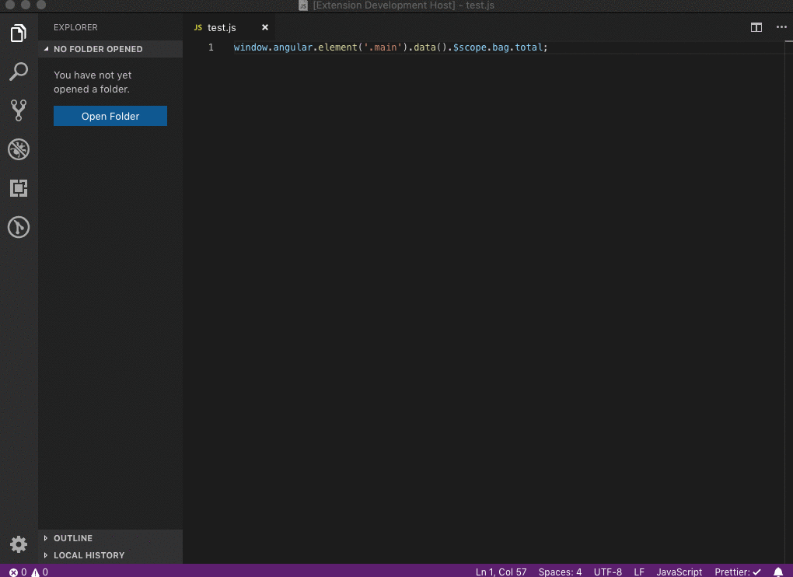

# vscode-oat

Auto tranform object access to safer (nullable) object access. e.g. && chain".

## Example

## Extension Settings

Multiple tranform to options coming soon. only && chain available by 1.0.0

Possible options:
- Ternary
- Elvis like
- try catch

## Known Issues

None

## Release Notes

Major and minor release change log

### 1.0.0

Initial release of vscode-oat
